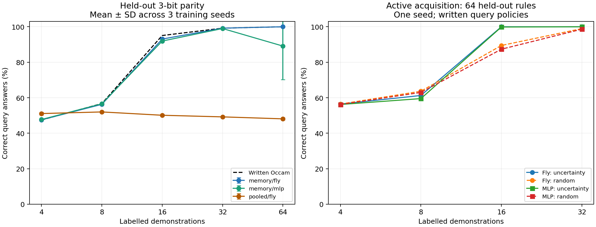

# Этап 5: новое правило по примерам

Источник результатов — 21 подтверждающее обучение по 6000 шагов: по три seed на каждое из семи сравнений. Ниже приведены средние всех трёх запусков, а не лучший seed. Все финальные тесты уже открыты.

Система со структурированной памятью переносит обучение на полностью удержанные семейства: чётность двух битов — **100.00%**, трёх — **99.33%** правильных ответов при 32 демонстрациях. На четырёх битах за пределами данного класса гипотез — **46.07%**.

**Это гибридная система.** Перебор подмножеств признаков, статистики и извлечение ответов из памяти даны программно; сеть учится оценивать полезность частей этой памяти. Значение нового правила поступает из демонстраций. Успех не означает, что коннектом сам изобрёл соответствующий алгоритм.

## Основные результаты

Каждая клетка — точность отдельных вопросов. В основных группах по 32 демонстрации и 32 новых входа на эпизод. Для новых семейств ни одного их правила не было в обучении или validation.

| Модель | Новые обычные правила | XOR 2 | Чётность 3 | Большинство 3 | Мультиплексор 3 | Чётность 4 | 12 входных битов |
|---|---:|---:|---:|---:|---:|---:|---:|
| memory/fly | 100.00% | 100.00% | 99.33% | 99.14% | 98.17% | 46.07% | 99.03% |
| memory/rewired | 100.00% | 100.00% | 99.33% | 99.12% | 98.21% | 46.19% | 99.05% |
| memory/frozen | 100.00% | 100.00% | 99.33% | 99.14% | 98.22% | 46.00% | 99.05% |
| memory/no_edges | 100.00% | 100.00% | 99.33% | 99.14% | 98.59% | 45.78% | 99.05% |
| memory/mlp | 100.00% | 100.00% | 98.58% | 99.40% | 98.51% | 46.68% | 97.09% |
| pooled/fly | 74.03% | 49.53% | 48.02% | 49.27% | 48.80% | 49.35% | — |
| pooled/mlp | 74.01% | 49.70% | 48.08% | 49.05% | 49.06% | 49.37% | — |

Полностью верный эпизод — более строгая метрика: правильны все 32 ответа.

| Модель | XOR 2: эпизоды | Чётность 3: эпизоды | Большинство 3: эпизоды | Мультиплексор 3: эпизоды |
|---|---:|---:|---:|---:|
| memory/fly | 100.00% | 95.54% | 94.20% | 89.45% |
| memory/rewired | 100.00% | 95.54% | 94.20% | 89.45% |
| memory/mlp | 100.00% | 88.24% | 95.39% | 89.97% |
| pooled/fly | 0.00% | 0.00% | 0.00% | 0.00% |

## Насколько помогает именно обученная сеть

| Контроль без обучения | XOR 2 | Чётность 3 | Большинство 3 | Мультиплексор 3 |
|---|---:|---:|---:|---:|
| symbolic_occam | 100.00% | 99.33% | 99.61% | 99.22% |
| uniform_memory | 60.66% | 47.49% | 82.56% | 76.14% |
| untrained_fly | 60.13% | 47.39% | 82.51% | 75.92% |
| nearest_neighbor | 71.54% | 56.19% | 79.79% | 79.11% |
| majority | 49.25% | 48.44% | 49.75% | 49.00% |

`symbolic_occam` — написанный выбор наименьшего непротиворечивого подмножества признаков; при противоречиях сначала минимизируется ошибка на демонстрациях. Он получает только те же демонстрации и вопросы. Это самостоятельный алгоритмический baseline, а не правильный ответ, которым исправляют сеть.

MLP, изменённый граф и отсутствие исходных связей сравниваются при одинаковом интерфейсе памяти. Эти результаты не устанавливают особого преимущества исходного биологического графа. Разница с pooled включает сильное различие искусственных представлений, не только памяти.

## Сколько демонстраций нужно

Ниже один и тот же набор правил чётности трёх битов и те же вопросы; демонстрации вложены. Весовые параметры моделей при увеличении контекста не меняются.

| Демонстрации | memory/fly: вопросы | memory/fly: полные эпизоды | memory/MLP: вопросы | Написанный Occam |
|---:|---:|---:|---:|---:|
| 4 | 47.56% | 0.00% | 47.74% | 47.46% |
| 8 | 56.28% | 0.00% | 56.59% | 56.74% |
| 16 | 93.07% | 52.60% | 91.94% | 95.07% |
| 32 | 99.22% | 95.31% | 99.01% | 99.22% |
| 64 | 100.00% | 100.00% | 89.11% | 100.00% |

Больше примеров не гарантирует улучшения: 64 демонстрации выходят за учебный диапазон 8–32, и средний результат memory/MLP здесь снижается до 89.11%. Это сохранённый результат переноса, без подбора модели по этому тесту.



## Активные вопросы

64 новых правила: 32 чётности трёх битов и 32 большинства. Одинаковые начальные примеры и контрольные вопросы, сравнение seed 0 двух архитектур. Следующий вопрос выбирает написанная политика максимальной неопределённости прогноза. Среда даёт ответ только на этот выбранный вход; контрольные входы запрещены к запросу.

| Модель / выбор примеров | 4 | 8 | 16 | 32 |
|---|---:|---:|---:|---:|
| memory_fly_seed0/uncertainty | 56.45% | 61.28% | 100.00% | 100.00% |
| memory_fly_seed0/random | 56.45% | 63.67% | 89.45% | 98.97% |
| memory_mlp_seed0/uncertainty | 56.20% | 59.52% | 99.85% | 100.00% |
| memory_mlp_seed0/random | 56.20% | 62.99% | 87.35% | 98.63% |

Разница активного и случайного выбора для memory/fly при 16 примерах: **+10.55 процентного пункта**. Одна инициализация на архитектуру и 64 правила — ограниченная проверка. При восьми примерах активная политика хуже случайной; выигрыш не универсален. Алгоритм выбора вопроса не обучен и не является самостоятельным целеполаганием.

## Ошибки, неопределённость и устойчивость

| Изменение демонстраций (чётность 3) | memory/fly | memory/MLP | Написанный Occam |
|---|---:|---:|---:|
| support_order | 99.33% | 98.58% | — |
| coordinate_order | 99.33% | 98.58% | — |
| flip_1 | 98.57% | 64.14% | 98.62% |
| flip_8 | 56.75% | 49.34% | 56.88% |
| shuffle_labels | 48.79% | 48.82% | 49.69% |
| absent_support | 50.08% | 50.08% | — |

При 32 демонстрациях в группе чётности трёх битов **98.54%** вопросов однозначны во всём классе функций не более трёх координат. Точность memory/fly на них: **100.00%**. Эту проверку выполняет отдельный код; она не меняет прогноз. Для шумных примеров или правил вне заданного класса однозначность не гарантирует истинность.

Обнуление связей обученной memory/fly даёт 99.25% на чётности трёх битов. Это вмешательство в уже обученную модель; отдельное обучение варианта no_edges приведено в основной таблице.

Перестановочная инвариантность memory обеспечивается перебором подмножеств и усреднением, а не приобретена в обучении. Устойчивость к ложным меткам оценивается отдельно: flip_1 — один неверный пример, flip_8 — восемь из 32. Высокая уверенность сети не используется как доказательство. absent_support — отдельный нейтральный прогноз p=0.5, а не запуск сети на пустом контексте: текущий API требует хотя бы один пример.

## Данные и воспроизводимость

- Учебные правила: 188; validation: 26; обычный test: 26. Учебных эпизодов: 6000.
- Новые семейства: 56 правил XOR/XNOR; 112 чётности трёх битов; 112 большинства; 128 мультиплексора; 128 чётности четырёх битов; 128 новых правил при ширине 12.
- Пять пилотов использовали только train/validation. Все 21 подтверждающих запуска, веса best/last с оптимизатором и RNG, журналы, предсказания и отрицательные результаты сохранены.
- Метки создаёт процедурный генератор Python. В inference нет учителя, ID правила и меток query; изменение этих скрытых полей не меняет вывод.
- Подробная спецификация: `STAGE5_PROTOCOL.md`; хэши исходников и датасетов: `results/stage5/confirmation/plan.json`; структурные проверки: `results/stage5/checks.json`.
- Средние/стандартные отклонения трёх seed и предсказания по каждому правилу доступны в `results/stage5/summary.json` и файлах отдельных запусков. Вопросы одного правила не объявляются независимыми наблюдениями.

```bash
python fly_rules.py --examples-file data/stage5/demo.json --suggest
python stage5_train.py --mode memory --conditions fly --seeds 0 --steps 6000 --eval-every 1000 --output results/stage5/reproduction
python stage5_report.py
```

Для нового обучения не перезаписывайте подтверждающие запуски. Для `--resume` скопируйте каталог с `last.pt` и `best.pt`, задайте путь копии и увеличьте общее число шагов. Восстанавливаются веса, оптимизатор и RNG; cosine пересчитывается, поэтому это не эквивалент единому изначально более длинному обучению.

## Что изменилось и что остаётся дальше

Появилось применение новых ограниченных правил по демонстрациям, изменение поведения без переобучения весов и запрос дополнительных примеров. Ранее успешные длинные вычисления складывались из элементарных переходов, полностью присутствовавших в обучении.

Текущее ограничение — вручную заданная гипотеза о максимум трёх существенных бинарных координатах и сильный механизм ассоциативной памяти. Следующий содержательный опыт должен обучать построение и расширение самих гипотез либо выбор операций, с новыми финальными семействами и сравнением с простыми алгоритмами при одинаковом бюджете. Повторный тест этих открытых семейств новой независимой оценкой не будет.

Используется 256 нейронов и 7514 связей из источника на 138639 нейронов. Нет свободного русского языка, произвольного программирования, доказательства общего интеллекта или превосходства мозга мухи над человеческим.

Идейные источники: эпизодическое обучение с памятью в [Matching Networks](https://arxiv.org/abs/1606.04080) и исследование композиционного метаобучения [Lake и Baroni](https://www.nature.com/articles/s41586-023-06668-3). Здесь иной метод и набор задач; результаты этих статей не воспроизводились.
