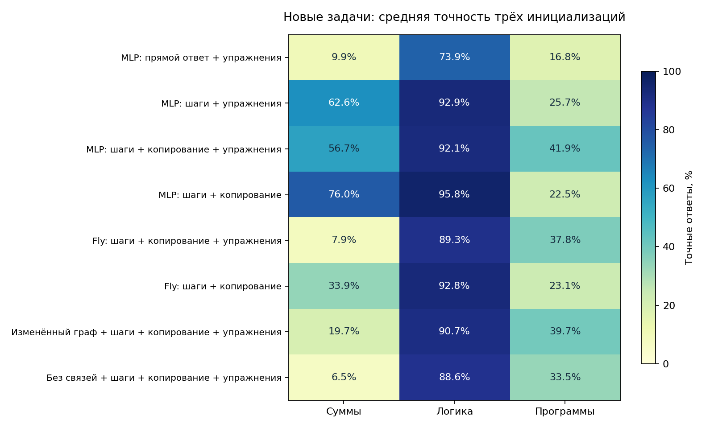

# Этап 6: одна нейросеть для сумм, логики и программ

Обучена с нуля одна общая символьная архитектура для трёх семейств. На входе только текст: сеть сама генерирует значения операндов, промежуточные результаты и ответ. Парсер программы, правильное состояние регистров и арифметический решатель при нейронном выводе не используются.

Во всех вариантах используется небольшой causal Transformer. Метка MLP означает обычные полносвязные блоки внутри него; fly/rewired/no_edges меняют эти блоки, сохраняя искусственные attention, вход и выход. Это не сравнение полного живого мозга с Transformer.

Этапы 3–5 использовали заданный порядок разрядов, интерфейс ленты или заранее вычисленные статистики структурированной памяти. Этап 6 проверяет работу с текстовым описанием задач. Проценты этих этапов нельзя сравнивать напрямую: задачи и помощь со стороны программного интерфейса различаются.

Проверены **24 кандидата**: восемь вариантов × три seed, по 8000 шагов. Четыре законченных пилота переиспользованы, 20 подтверждающих обучений новые. Вместе с подбором выполнено 30 отдельных обучений, 212,800 шагов и 3,404,800 предъявлений примеров. Это не число уникальных учебных задач. Все тесты теперь открыты.

**Ни общий интеллект, ни полная эмуляция мозга не получены.** Это три небольших формальных семейства; способность писать произвольные программы и понимать свободный русский язык не проверялась.

Основное улучшение на обычных новых задачах: подробные шаги повышают среднюю точность MLP с упражнениями с 33.52% до 60.42%. Число обновлений одинаковое, но промежуточные записи дают больше целевых токенов. Упражнения улучшают программы ценой части точности сумм; устойчивого выигрыша исходного коннектома перед изменённым графом и обычными блоками не установлено. На больших числах все 24 модели получили 0%; перенос длинных вычислений остаётся слабым.

## Обычные новые задачи

Каждая клетка — средняя точность в процентах ± выборочное стандартное отклонение трёх seed. По 240 примеров каждого семейства на модель; не лучший запуск. Это разброс инициализаций, не доверительный интервал для всех возможных задач.

| Вариант | Суммы | Логика | Программы | Среднее трёх | Весь текст шагов и ответа |
|---|---:|---:|---:|---:|---:|
| MLP: прямой ответ + упражнения | 9.86 ± 8.84 | 73.89 ± 7.71 | 16.81 ± 2.44 | 33.52 ± 3.70 | 33.52 ± 3.70 |
| MLP: шаги + упражнения | 62.64 ± 3.96 | 92.92 ± 2.73 | 25.69 ± 0.64 | 60.42 ± 1.87 | 49.12 ± 3.88 |
| MLP: шаги + копирование + упражнения | 56.67 ± 22.43 | 92.08 ± 1.50 | 41.94 ± 12.91 | 63.56 ± 11.06 | 56.53 ± 13.49 |
| MLP: шаги + копирование | 75.97 ± 13.85 | 95.83 ± 2.60 | 22.50 ± 0.72 | 64.77 ± 4.80 | 57.13 ± 4.81 |
| Fly: шаги + копирование + упражнения | 7.92 ± 1.82 | 89.31 ± 1.05 | 37.78 ± 10.64 | 45.00 ± 3.37 | 35.83 ± 2.66 |
| Fly: шаги + копирование | 33.89 ± 21.13 | 92.78 ± 1.05 | 23.06 ± 2.06 | 49.91 ± 7.74 | 40.74 ± 7.06 |
| Изменённый граф + шаги + копирование + упражнения | 19.72 ± 15.75 | 90.69 ± 2.37 | 39.72 ± 15.51 | 50.05 ± 8.48 | 38.94 ± 7.25 |
| Без связей + шаги + копирование + упражнения | 6.53 ± 0.87 | 88.61 ± 5.04 | 33.47 ± 10.29 | 42.87 ± 3.11 | 32.96 ± 3.93 |

Для direct последний столбец совпадает с ответом: промежуточные шаги не запрашиваются. Для resolved правильный итог не гарантирует правильности всех написанных вычислений.



## Перенос за учебное распределение

Новые сочетания — удержанные пары логических операторов; alias — одна переменная в обоих операндах; новые имена — те же 240 обычных программ после a/b/c/d→i/j/k/l. Символы i/j/k/l есть в словаре, но не встречаются положительными символами в обучающих запросах или ответах: этот тест смешивает переименование с отсутствием обучения самих букв. Глубокая логика одновременно меняет глубину и форму дерева. Большие значения — суммы чисел 100–999.

| Вариант | Сочетания логики | Глубина 8/12/16 | Alias | Новые имена | Большие числа |
|---|---:|---:|---:|---:|---:|
| MLP: прямой ответ + упражнения | 62.64 ± 1.88 | 56.53 ± 4.49 | 22.78 ± 1.68 | 16.67 ± 3.25 | 0.00 ± 0.00 |
| MLP: шаги + упражнения | 68.19 ± 4.21 | 52.08 ± 5.07 | 23.06 ± 3.54 | 21.39 ± 1.34 | 0.00 ± 0.00 |
| MLP: шаги + копирование + упражнения | 72.50 ± 0.83 | 57.78 ± 1.97 | 35.56 ± 7.97 | 9.17 ± 2.08 | 0.00 ± 0.00 |
| MLP: шаги + копирование | 70.00 ± 3.70 | 52.50 ± 5.45 | 24.17 ± 1.25 | 10.28 ± 3.47 | 0.00 ± 0.00 |
| Fly: шаги + копирование + упражнения | 66.25 ± 2.20 | 55.42 ± 2.20 | 30.42 ± 5.42 | 14.17 ± 1.82 | 0.00 ± 0.00 |
| Fly: шаги + копирование | 71.39 ± 4.68 | 46.11 ± 18.95 | 24.58 ± 2.73 | 12.22 ± 1.05 | 0.00 ± 0.00 |
| Изменённый граф + шаги + копирование + упражнения | 70.14 ± 1.97 | 55.69 ± 2.93 | 32.64 ± 5.55 | 10.97 ± 1.58 | 0.00 ± 0.00 |
| Без связей + шаги + копирование + упражнения | 70.83 ± 3.97 | 55.83 ± 1.50 | 28.75 ± 3.33 | 11.53 ± 2.29 | 0.00 ± 0.00 |

У логических деревьев внешний and/or иногда определяет ответ без вычисления всей вложенной части. Большая глубина дерева поэтому не гарантирует столь же длинную необходимую зависимость. Полное совпадение текста шагов и ответа на deep_logic: MLP + копирование + упражнения — 0.00 ± 0.00%; fly с тем же интерфейсом — 0.00 ± 0.00%. Иная запись при верном итоге может отражать иной способ вычисления; одна текстовая метрика не доказывает, что ответ был угадан или что записанные шаги причинно использованы.

| Вариант | Суммы 8/12 шагов | Программы 8/12 | Суммы 24/32 | Программы 24/32 |
|---|---:|---:|---:|---:|
| MLP: прямой ответ + упражнения | 0.00 ± 0.00 | 19.44 ± 3.15 | 0.83 ± 0.83 | 18.33 ± 5.83 |
| MLP: шаги + упражнения | 0.56 ± 0.96 | 13.89 ± 0.96 | 0.00 ± 0.00 | 18.89 ± 2.68 |
| MLP: шаги + копирование + упражнения | 0.00 ± 0.00 | 15.00 ± 0.83 | 0.00 ± 0.00 | 9.17 ± 3.00 |
| MLP: шаги + копирование | 0.00 ± 0.00 | 11.11 ± 6.31 | 0.28 ± 0.48 | 10.00 ± 6.29 |
| Fly: шаги + копирование + упражнения | 0.00 ± 0.00 | 13.06 ± 2.55 | 0.00 ± 0.00 | 14.17 ± 4.33 |
| Fly: шаги + копирование | 0.28 ± 0.48 | 14.17 ± 6.01 | 0.00 ± 0.00 | 17.78 ± 5.36 |
| Изменённый граф + шаги + копирование + упражнения | 0.00 ± 0.00 | 15.56 ± 3.76 | 0.28 ± 0.48 | 10.28 ± 0.48 |
| Без связей + шаги + копирование + упражнения | 0.00 ± 0.00 | 14.17 ± 2.20 | 0.28 ± 0.48 | 15.28 ± 4.11 |

Лимит одинаков: 512 новых символов, greedy; отсутствие EOS считается ошибкой. Максимальная учебная длина: 6 слагаемых или 4 присваивания. В длинных суммах слагаемые 0–9, поэтому это отдельный сдвиг распределения, а не идеально изолированная проверка длины. Подробные результаты по каждой длине и доле завершения — в `final_metrics.json`.

## Контроли и роль коннектома

Исходная топология: 256 узлов, 7514 связей; повторяется в трёх искусственных блоках. Во всём источнике 138639 нейронов, но полный граф здесь не обучается. Варианты fly/rewired имеют 302542 параметра; только 22542 относятся к коэффициентам исходных связей. MLP с копированием — 312424; no_edges — 280000. Сходство размера приблизительное. Rewired сохраняет степени узлов; no_edges пропускает передачу по этим связям. Даже выигрыш fly над no_edges сам по себе не доказывает биологической специфичности.

Отключение компонента без дообучения, одни и те же первые 90 обычных тестов. Метрика — macro accuracy семейств; это дополнительная диагностика, не выбор модели.

| Вариант | Исходная модель | Копирование отключено | Связи отключены |
|---|---:|---:|---:|
| MLP: прямой ответ + упражнения | 34.88 ± 6.30 | — | — |
| MLP: шаги + упражнения | 62.11 ± 3.57 | — | — |
| MLP: шаги + копирование + упражнения | 67.25 ± 10.17 | 11.50 ± 5.72 | — |
| MLP: шаги + копирование | 60.51 ± 5.40 | 7.68 ± 5.57 | — |
| Fly: шаги + копирование + упражнения | 51.18 ± 5.15 | 14.25 ± 5.99 | 50.17 ± 3.95 |
| Fly: шаги + копирование | 49.62 ± 10.09 | 12.82 ± 2.45 | 45.01 ± 4.16 |
| Изменённый граф + шаги + копирование + упражнения | 50.36 ± 14.65 | 10.99 ± 4.80 | 48.34 ± 13.39 |
| Без связей + шаги + копирование + упражнения | 48.43 ± 4.99 | 11.03 ± 5.84 | 48.43 ± 4.99 |

| Явный ненейронный baseline | Суммы | Логика | Программы |
|---|---:|---:|---:|
| training_majority | 0.42 | 50.00 | 16.25 |
| ignore_computation | 0.83 | 54.58 | 12.50 |
| written_interpreter | 100.00 | 100.00 | 100.00 |

Эти baselines используют процедурную структурированную спецификацию задачи. Написанный интерпретатор служит проверкой меток, а не равным по представлению соперником символьной сети. Он никогда не исправляет её вывод. Самый частый ответ оценивается только по исходному train.

## Стоимость обучения и эффект учебной программы

В исходном train 28000 строк. Блок простых упражнений добавляет 20516 строк, из них 2608 совпадают с train; объединение содержит 45908 уникальных задач. Пересечение с validation и тестовыми строками равно нулю. Метки созданы Python-программами.

| Вариант | Параметры | Миллионы целевых токенов за запуск | Доля коротких упражнений |
|---|---:|---:|---:|
| MLP: прямой ответ + упражнения | 306183 | 0.329 | 45.0% |
| MLP: шаги + упражнения | 306183 | 3.721 | 45.0% |
| MLP: шаги + копирование + упражнения | 312424 | 3.721 | 45.0% |
| MLP: шаги + копирование | 312424 | 4.537 | 0.0% |
| Fly: шаги + копирование + упражнения | 302542 | 3.721 | 45.0% |
| Fly: шаги + копирование | 302542 | 4.537 | 0.0% |
| Изменённый граф + шаги + копирование + упражнения | 302542 | 3.721 | 45.0% |
| Без связей + шаги + копирование + упражнения | 280000 | 3.721 | 45.0% |

Все кандидаты видят 128000 примеров за 8000 обновлений. Промежуточные записи дают больше целевых токенов, а упражнения меняют состав и среднюю длину примеров. Поэтому это практическое сравнение способов обучения при равном числе обновлений, не изоляция архитектуры при равном вычислительном бюджете. Пилоты и исходники до изменений сохранены, включая неудачные результаты.

## Ошибки и запуск

`summary.json` содержит парное сравнение переименованных программ и классификацию первого расхождения написанных шагов: формат, порядок операции, значение операнда, результат операции, число шагов или окончательный ответ. Это наблюдаемая ошибка текста, а не доказательство внутреннего механизма рассуждения.

Модель по умолчанию: `resolved_copy_atomic_mlp_seed1`, выбрана только по validation до теста. Её не подменяют лучшим результатом окончательной проверки.

Результаты именно этого checkpoint на обычном test (не средние группы): sum 80.42%, logic 90.42%, code 50.42%.

У этой модели запрос последнего записанного регистра даёт 80.92% на 131 программах; более раннего — 13.76% на 109. В 56 случаях все промежуточные записи правильны, но ответ неверен; в 52 из них ответ равен последнему написанному значению. Это наблюдение указывает на проблему выбора нужного регистра, но не доказывает внутренний механизм сети. Исходные данные диагноза — `readout_diagnosis.json`.

В программах very_long нужно в среднем 28 записанных шагов; модель выдаёт лишь 2.41. Она часто заканчивает слишком рано, хотя разрешены 512 новых токенов. Это отдельная наблюдаемая причина слабого переноса длины; увеличение лимита само по себе её не исправляет.

```bash
python fly_reason.py 'сумма 7,5,11,15'
python fly_reason.py 'логика xor(1,and(1,0))' --json
python fly_reason.py 'код a=2;b=3;c=0;d=1;a=(a+b)%10;?a'
```

Ответ и шаги печатаются как сгенерированы сетью. Возможны ошибки даже в простых примерах. CLI не обучает модель и не запускает фоновое самообучение. Русский интерфейс ограничен префиксами «сумма», «логика», «код» и точным форматом задачи.

## Воспроизводимость

```bash
python stage6_checks.py
python stage6_train.py --mode resolved --copy --condition mlp --seed 0 --steps 8000 --eval-every 2000 --output results/stage6/reproduction
python stage6_report.py
```

Обучающий запуск с теми же данными и seed — проверка воспроизведения, не новый независимый тест. Полный список команд задаёт `stage6_run.py`, а замороженные настройки — `results/stage6/confirmation/plan.json`. Файлы данных уже приложены; генератор намеренно не перезаписывает их. Зависимости — `requirements.txt`.

Хеши исходников, данных, графа и всех best/last весов после теста совпали. Пересчитаны 57,600 основных нейронных предсказаний. Проверены независимые метки, отсутствие утечки будущих целевых символов, эквивалентность cached/full inference и наличие градиентов связей. Подробности — `checks.json`, `atomic_checks.json`, `summary.json`.

Протокол, границы метода и первичные научные источники: [STAGE6_PROTOCOL.md](STAGE6_PROTOCOL.md). Идеи обучения промежуточным вычислениям — [Show Your Work](https://arxiv.org/abs/2112.00114), обучаемого копирования — [Pointer-Generator Networks](https://arxiv.org/abs/1704.04368), исполнения программ по тексту — [Learning to Execute](https://arxiv.org/abs/1410.4615). Это собственный небольшой опыт, не воспроизведение численных результатов этих статей.
