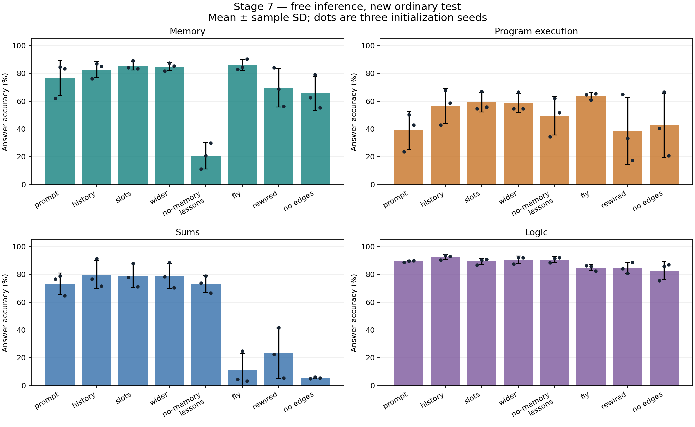

**Этап 7: обучение адресации и памяти от прежних весов**

Средняя точность четырёх задач у history — 77.88%, у prompt — 69.62% (по три seed). Число параметров у них одинаковое.
Дополнительные ячейки: 78.26%; небольшое расширение FF: 78.26%. По validation заранее выбран history_seed1.

**Восстановление после потери рабочей папки**

В GitHub сохранились 14 законченных обучений. Остальные 10 воспроизведены по прежним исходникам, данным, seed и настройкам. Выбранная модель не менялась; все тесты были уже открыты.
Сохранённый повторный прогресс восстановления: 80,000 обновлений и 1,280,000 предъявлений примеров. Фактическая стоимость выше, если работа после последнего checkpoint повторялась при прерывании. Это повторная работа, не новые независимые запуски.
Контрольная сумма карты всех 48 best/last не совпала с прежней: контрольные точки десяти воспроизведённых запусков имеют статус восстановленных артефактов, побайтная идентичность всему исходному архиву не подтверждена.
С опубликованной до сбоя сводкой совпало 20 из 40 округлённых групповых метрик. Числа ниже рассчитаны из полного нынешнего архива.
Подробности: results/stage7/recovery/restore_manifest.json, checkpoint_reconstruction.json и observed_metric_comparison.json.

| Вариант / метрика | Ранее наблюдалось | Воспроизведено |
|---|---:|---:|
| no_memory_curriculum / memory | 22.08% | 20.69% |
| no_memory_curriculum / code | 47.64% | 49.44% |
| no_memory_curriculum / sum | 71.53% | 73.06% |
| no_memory_curriculum / logic | 89.86% | 90.69% |
| no_memory_curriculum / macro | 57.78% | 58.47% |
| fly / memory | 84.86% | 85.97% |
| fly / code | 63.06% | 63.61% |
| fly / sum | 10.56% | 10.97% |
| fly / logic | 84.72% | 84.86% |
| fly / macro | 60.80% | 61.35% |
| rewired / memory | 70.42% | 69.72% |
| rewired / code | 39.31% | 38.61% |
| rewired / sum | 25.97% | 23.19% |
| rewired / logic | 85.00% | 84.58% |
| rewired / macro | 55.17% | 54.03% |
| no_edges / memory | 71.67% | 65.69% |
| no_edges / code | 47.92% | 42.64% |
| no_edges / sum | 5.14% | 5.56% |
| no_edges / logic | 83.89% | 82.78% |
| no_edges / macro | 52.15% | 49.17% |

Завершены 24 подтверждающих обучения (восемь вариантов × три seed × 8000 шагов) и 6 пилотов по 1600 шагов.
Всего 201,600 шагов по завершённым расписаниям, 3,225,600 предъявлений учебных примеров и 104,166,928 целевых токенов.
Это число предъявлений в отдельных конфигурациях, а не уникальных задач. Дополнительные затраты восстановления указаны выше; профилирование и проверочные обновления не включены.

Модели продолжают соответствующие best.pt этапа 6. Оптимизатор создан заново;
при техническом прерывании той же серии восстанавливались last.pt, optimizer и RNG.
Часть работы после последнего checkpoint могла повторяться; времена отдельных вызовов
не выдаются за полное время всей серии.

Новый test содержит 960 задач: по 240 памяти, программ, сумм и логики.
Память — буквальные записи и перезаписи четырёх именованных переменных.
Программы — заданные последовательности операций +/−/* modulo 10, не генерация произвольного кода.
Модель получает текст и сама пишет промежуточные значения и ответ.
Учителя, правильных регистров и арифметического интерпретатора в основном выводе нет.

**Средние трёх запусков на новом обычном тесте**

Значения: проценты ± выборочное стандартное отклонение seed. Это не доверительный интервал по всем возможным задачам.

| Вариант | Память | Программы | Суммы | Логика | Среднее четырёх |
|---|---:|---:|---:|---:|---:|
| Копирование запроса | 76.67 ± 12.64 | 39.03 ± 13.75 | 73.33 ± 7.65 | 89.44 ± 0.64 | 69.62 ± 6.53 |
| Копирование истории | 82.78 ± 5.75 | 56.53 ± 12.65 | 79.86 ± 10.17 | 92.36 ± 1.73 | 77.88 ± 6.75 |
| История + ячейки памяти | 85.56 ± 3.15 | 59.17 ± 6.88 | 79.03 ± 8.39 | 89.31 ± 2.29 | 78.26 ± 4.67 |
| История + расширенный FF | 84.86 ± 2.96 | 58.61 ± 6.98 | 79.03 ± 8.98 | 90.56 ± 2.65 | 78.26 ± 4.66 |
| Без упражнений памяти | 20.69 ± 9.38 | 49.44 ± 13.88 | 73.06 ± 6.07 | 90.69 ± 2.06 | 58.47 ± 5.85 |
| Граф мухи + история | 85.97 ± 3.94 | 63.61 ± 2.44 | 10.97 ± 12.16 | 84.86 ± 2.06 | 61.35 ± 2.38 |
| Изменённый граф + история | 69.72 ± 13.98 | 38.61 ± 24.19 | 23.19 ± 18.13 | 84.58 ± 3.97 | 54.03 ± 11.14 |
| Без рёбер + история | 65.69 ± 12.19 | 42.64 ± 23.00 | 5.56 ± 0.64 | 82.78 ± 6.41 | 49.17 ± 9.12 |



**До и после дообучения: один и тот же новый тест**

Исходные модели оценены отдельно после фиксации нового победителя. Разница включает новую учебную программу и дополнительные шаги.

| Вариант | Память до | Память после | Программы до | Программы после |
|---|---:|---:|---:|---:|
| Копирование запроса | 14.03 ± 9.60 | 76.67 ± 12.64 | 13.75 ± 1.67 | 39.03 ± 13.75 |
| Копирование истории | 14.03 ± 9.60 | 82.78 ± 5.75 | 13.75 ± 1.67 | 56.53 ± 12.65 |
| История + ячейки памяти | 14.03 ± 9.60 | 85.56 ± 3.15 | 13.75 ± 1.67 | 59.17 ± 6.88 |
| История + расширенный FF | 14.03 ± 9.60 | 84.86 ± 2.96 | 13.75 ± 1.67 | 58.61 ± 6.98 |
| Без упражнений памяти | 14.03 ± 9.60 | 20.69 ± 9.38 | 13.75 ± 1.67 | 49.44 ± 13.88 |
| Граф мухи + история | 11.67 ± 2.17 | 85.97 ± 3.94 | 14.17 ± 1.10 | 63.61 ± 2.44 |
| Изменённый граф + история | 19.86 ± 8.35 | 69.72 ± 13.98 | 14.17 ± 1.91 | 38.61 ± 24.19 |
| Без рёбер + история | 20.14 ± 3.76 | 65.69 ± 12.19 | 14.03 ± 3.94 | 42.64 ± 23.00 |

**Последняя запись и остальные запросы**

Для памяти и программ каждая группа содержит по 120 обычных тестов; ответы 0–9 сбалансированы внутри групп.

Группа «остальные» включает нетронутые исходные значения, а не только более ранние вычисления. Раздельные результаты приведены в дополнительной диагностике.

| Вариант | Память: последняя | Память: остальные | Программа: последняя | Программа: остальные |
|---|---:|---:|---:|---:|
| Копирование запроса | 95.56 ± 5.55 | 57.78 ± 19.74 | 36.39 ± 9.29 | 41.67 ± 19.60 |
| Копирование истории | 99.17 ± 0.83 | 66.39 ± 10.72 | 56.94 ± 15.01 | 56.11 ± 10.55 |
| История + ячейки памяти | 98.89 ± 1.27 | 72.22 ± 5.55 | 56.11 ± 7.88 | 62.22 ± 6.03 |
| История + расширенный FF | 100.00 ± 0.00 | 69.72 ± 5.91 | 56.39 ± 7.56 | 60.83 ± 6.61 |
| Без упражнений памяти | 20.83 ± 10.10 | 20.56 ± 8.91 | 47.78 ± 9.18 | 51.11 ± 18.64 |
| Граф мухи + история | 96.67 ± 1.44 | 75.28 ± 6.99 | 60.56 ± 2.55 | 66.67 ± 3.00 |
| Изменённый граф + история | 98.89 ± 1.92 | 40.56 ± 27.92 | 37.22 ± 20.96 | 40.00 ± 27.65 |
| Без рёбер + история | 92.22 ± 5.02 | 39.17 ± 26.71 | 39.72 ± 18.45 | 45.56 ± 28.92 |

**Перенос на новые имена и длину**

Новые имена составлены из знакомых a/b/c/d. Другой тест использует i/j/k/l, отсутствующие в положительных учебных входах и целях.
Парные переименования сохраняют смысл и ответ исходного теста. Согласованные ошибочные ответы не считаются успехом.

| Вариант | Новые имена: память | Новые имена: код | Новые буквы: среднее | 16 записей: память | 16 операций: код | 32 записи: память | 32 операции: код |
|---|---:|---:|---:|---:|---:|---:|---:|
| Копирование запроса | 64.17 ± 4.23 | 25.56 ± 8.42 | 27.43 ± 4.29 | 29.58 ± 15.72 | 12.29 ± 0.72 | 16.25 ± 2.72 | 6.46 ± 2.60 |
| Копирование истории | 59.44 ± 8.50 | 28.33 ± 7.01 | 16.94 ± 2.14 | 32.29 ± 11.05 | 10.21 ± 1.30 | 18.96 ± 6.68 | 9.79 ± 4.02 |
| История + ячейки памяти | 55.42 ± 16.24 | 27.22 ± 7.28 | 21.88 ± 1.80 | 27.71 ± 5.81 | 8.12 ± 3.48 | 18.33 ± 2.01 | 7.50 ± 1.65 |
| История + расширенный FF | 55.97 ± 10.48 | 28.19 ± 4.59 | 20.21 ± 4.33 | 32.71 ± 7.02 | 12.50 ± 3.31 | 16.67 ± 5.32 | 8.33 ± 2.53 |
| Без упражнений памяти | 22.08 ± 6.14 | 28.33 ± 3.82 | 13.12 ± 2.01 | 13.12 ± 8.20 | 11.88 ± 1.88 | 11.46 ± 7.86 | 8.96 ± 1.30 |
| Граф мухи + история | 57.92 ± 24.04 | 22.50 ± 7.98 | 20.35 ± 1.22 | 22.92 ± 6.68 | 10.62 ± 3.25 | 13.33 ± 1.30 | 8.33 ± 3.82 |
| Изменённый граф + история | 59.03 ± 9.14 | 20.42 ± 7.23 | 14.24 ± 5.55 | 17.50 ± 3.48 | 8.33 ± 1.57 | 13.12 ± 4.96 | 11.25 ± 1.25 |
| Без рёбер + история | 53.89 ± 1.27 | 22.22 ± 5.28 | 16.25 ± 0.75 | 23.33 ± 7.86 | 9.38 ± 1.25 | 16.88 ± 3.48 | 8.54 ± 5.24 |

Учебные пределы: 8 записей памяти и 6 вычислительных присваиваний. В тестах 16/32 диапазоны значений и имён сохраняются.
Переименование и контрфактические пары разделяют исходные задачи; это дополнительные измерения, не независимые повторы эксперимента.

**Сохранение прежних навыков**

Ниже открытый test этапа 6, 720 задач. Используется только как историческая проверка сохранения; выбор модели по нему не делался.

У 54 из 240 старых программ абстрактная структура встречается в учебном пуле этапа 7. Точные старые тестовые запросы исключены из нового train; историческая проверка не является свежим тестом неизвестных структур.

| Вариант | Суммы до → после | Логика до → после | Программы до → после |
|---|---:|---:|---:|
| Копирование запроса | 56.67 ± 22.43 → 83.33 ± 6.01 | 92.08 ± 1.50 → 95.00 ± 0.72 | 41.94 ± 12.91 → 49.86 ± 18.66 |
| Копирование истории | 56.67 ± 22.43 → 88.75 ± 7.72 | 92.08 ± 1.50 → 95.00 ± 1.10 | 41.94 ± 12.91 → 82.78 ± 24.62 |
| История + ячейки памяти | 56.67 ± 22.43 → 87.92 ± 6.05 | 92.08 ± 1.50 → 94.17 ± 1.10 | 41.94 ± 12.91 → 92.22 ± 7.05 |
| История + расширенный FF | 56.67 ± 22.43 → 87.64 ± 5.28 | 92.08 ± 1.50 → 95.42 ± 1.67 | 41.94 ± 12.91 → 96.39 ± 3.15 |
| Без упражнений памяти | 56.67 ± 22.43 → 82.64 ± 5.66 | 92.08 ± 1.50 → 94.17 ± 1.10 | 41.94 ± 12.91 → 66.53 ± 11.97 |
| Граф мухи + история | 7.92 ± 1.82 → 17.64 ± 16.12 | 89.31 ± 1.05 → 90.28 ± 0.48 | 37.78 ± 10.64 → 98.33 ± 1.25 |
| Изменённый граф + история | 19.72 ± 15.75 → 32.36 ± 22.12 | 90.69 ± 2.37 → 91.81 ± 1.68 | 39.72 ± 15.51 → 60.00 ± 38.09 |
| Без рёбер + история | 6.53 ± 0.87 → 9.86 ± 1.58 | 88.61 ± 5.04 → 89.58 ± 5.45 | 33.47 ± 10.29 → 60.83 ± 39.17 |

**Модель по умолчанию и диагностика**

По validation до первого нового теста выбрана `history_seed1`. Это один checkpoint; его результаты не заменяют групповые средние.

| Семейство | Точность выбранной модели |
|---|---:|
| Память | 87.08% |
| Программы | 67.92% |
| Суммы | 91.25% |
| Логика | 93.75% |

Числа ошибок после правильных записей:

| Семейство | Правильные записи | Из них неверный ответ | Из этих ответов взято последнее значение |
|---|---:|---:|---:|
| memory | 238 | 30 | 13 |
| code | 115 | 16 | 5 |

Это описание наблюдаемых текстов, не доказательство внутреннего алгоритма.
Принудительно верные промежуточные записи, их изменения и отключения компонентов сохранены отдельно в diagnostics.json каждого запуска.
Изменённый префикс противоречит исходному запросу: реакция показывает зависимость от поданной истории, но не доказывает корректность или самостоятельное использование собственной памяти.
Каждый изменённый префикс пересчитывается с пустым кэшем. Вмешательства не исправляют основной вывод.
Контрфактическое изменение входа — отдельные корректные задачи с заново проверенными метками; парные результаты записаны в summary.json.

**Что именно сравнивалось**

Prompt и history имеют одинаковое число параметров; history расширяет область обучаемого копирования на уже написанный текст.
Slots добавляет 8 ячеек по 16 значений с обучаемыми адресами, записью и чтением. Ячейки не закреплены программно за именами переменных.
Во всех вариантах Transformer видит весь предыдущий текст. Эти задачи проверяют извлечение и использование контекста; хранение после удаления контекста не проверяется. Дополнительные ячейки могут обходиться обычным вниманием.
Wider добавляет по восемь независимых искусственных признаков в каждый обычный FF: 312 → 320. Нулевые начальные выходы сохраняют исходную функцию.
Это небольшой контроль дополнительной ёмкости, а не расширение биологического подграфа до 512 или 1024 нейронов.
Первый пилот wider использовал дублирование и мог сохранять симметрию; его исходники и результат сохранены, но он не является подтверждающим контролем ёмкости.
Контроль без упражнений памяти перераспределяет их долю на программы. Он меняет смесь данных, а не только один отдельный пример.

| Вариант | Обучаемых параметров | Целевых токенов за запуск, млн |
|---|---:|---:|
| Копирование запроса | 312,424 | 4.096 |
| Копирование истории | 312,424 | 4.096 |
| История + ячейки памяти | 317,257 | 4.096 |
| История + расширенный FF | 317,056 | 4.096 |
| Без упражнений памяти | 312,424 | 4.418 |
| Граф мухи + история | 302,542 | 4.096 |
| Изменённый граф + история | 302,542 | 4.096 |
| Без рёбер + история | 280,000 | 4.096 |

Каждый подтверждающий запуск получает 128000 примеров за 8000 обновлений. Время и вычислительная стоимость могут различаться.
Исходный граф на коротких программах даёт 63.61%, обычный history — 56.53%. При этом суммы: 10.97% и 79.86%; среднее четырёх: 61.35% и 77.88%. Результат одного семейства не означает общего преимущества графа.
Графовые варианты продолжают свои прежние веса, а не общий обычный checkpoint: сравнение включает историю их обучения.
Одна топология 256 узлов / 7514 рёбер повторена в трёх искусственных блоках. Большая часть модели — Transformer и адаптеры.
Три seed одной топологии не заменяют независимые биологические подграфы.

**Воспроизведение и границы вывода**

Протокол, данные, пилоты и источники опубликованы до новых тестов в коммите
[4411580](https://github.com/oxura/Drozofila-training/commit/4411580fd075c881119a8b6494a9e27753211f45).
Зафиксированы 72,960 основных новых предсказаний и 17,280 исторических проверок; диагностика и исходные модели сохранены дополнительно.
Хеши фиксированных данных, учебных исходников и старых исходных весов подтверждены. Сохранность checkpoint при повторной оценке проверена; сопоставление с исходной утраченной картой хешей описано выше.
Все финальные тесты этапа 7 теперь открыты. Новое улучшение требует нового независимого протокола.

```bash
python fly_memory.py 'код a=2;b=3;c=0;d=1;a=7;b=8;?a' --json
python fly_memory.py 'код a=2;b=3;c=0;d=1;a=(a+b)%10;b=(b+1)%10;?a' --json
python stage7_report.py
```

Это выполняющийся исследовательский прототип. Он может ошибаться. Русский интерфейс ограничен формальными префиксами.
Свободный русский язык, обучение произвольному новому правилу, генерация общих программ и интеллект человеческого уровня здесь не продемонстрированы.
Обучаемые контейнеры и промежуточные метки — предоставленная нами структура; их вклад учитывается отдельно.
План дальнейших опытов — [ROADMAP_BROAD_INTELLIGENCE.md](ROADMAP_BROAD_INTELLIGENCE.md); точный протокол — [STAGE7_PROTOCOL.md](STAGE7_PROTOCOL.md).


**Чтение исходного значения и действительно раннего результата**

Исходное значение ни разу не перезаписывалось; ранний результат записан, но не последней инструкцией. Подгруппы отдельно по ответам не балансировались.
В этапе 6 запрос всегда относился к записанному регистру, поэтому его старую разбивку нельзя напрямую сравнивать с объединённой группой «остальные» этапа 7.

| Вариант | Память: исходное (38) | Память: раннее записанное (82) | Код: исходное (78) | Код: раннее вычисленное (42) |
|---|---:|---:|---:|---:|
| Копирование запроса | 46.49 ± 22.07 | 63.01 ± 18.67 | 56.41 ± 26.02 | 14.29 ± 10.38 |
| Копирование истории | 58.77 ± 7.60 | 69.92 ± 12.22 | 65.38 ± 15.60 | 38.89 ± 8.36 |
| История + ячейки памяти | 63.16 ± 4.56 | 76.42 ± 6.72 | 73.08 ± 4.44 | 42.06 ± 9.01 |
| История + расширенный FF | 64.91 ± 1.52 | 71.95 ± 8.00 | 73.50 ± 5.34 | 37.30 ± 10.74 |
| Без упражнений памяти | 29.82 ± 19.40 | 16.26 ± 7.04 | 66.67 ± 25.02 | 22.22 ± 9.62 |
| Граф мухи + история | 67.54 ± 9.96 | 78.86 ± 5.76 | 78.63 ± 0.74 | 44.44 ± 8.36 |
| Изменённый граф + история | 39.47 ± 25.92 | 41.06 ± 29.40 | 47.44 ± 30.77 | 26.19 ± 22.96 |
| Без рёбер + история | 38.60 ± 25.01 | 39.43 ± 27.55 | 53.42 ± 32.59 | 30.95 ± 22.71 |

**Изменения при парных исходных seed**

Разницы в процентных пунктах ± выборочное SD трёх пар. Описательные эффекты на данном тесте, без утверждения статистической значимости.

| Изменение | Память | Программы | Среднее четырёх |
|---|---:|---:|---:|
| История вместо только запроса | 6.11 ± 6.99 | 17.50 ± 1.67 | 8.26 ± 1.22 |
| Ячейки в дополнение к истории | 2.78 ± 4.83 | 2.64 ± 7.89 | 0.38 ± 3.37 |
| Расширение FF в дополнение к истории | 2.08 ± 2.89 | 2.08 ± 8.43 | 0.38 ± 3.10 |
| Упражнения памяти вместо части программ | 55.97 ± 6.85 | -10.42 ± 1.50 | 11.15 ± 1.23 |

**Отключение компонентов после обучения**

Свободная генерация на одних и тех же первых 120 тестах. Средняя точность четырёх семейств. Это зависимость готовых весов от компонента, не сравнение с обучением без него.

| Вариант | Обычно | Без копирования истории | Без ячеек | Без рёбер |
|---|---:|---:|---:|---:|
| Копирование запроса | 72.95 ± 10.68 | — | — | — |
| Копирование истории | 78.30 ± 8.85 | 60.61 ± 4.11 | — | — |
| История + ячейки памяти | 82.17 ± 3.18 | 61.85 ± 4.08 | 79.58 ± 4.63 | — |
| История + расширенный FF | 82.08 ± 4.90 | 61.17 ± 3.17 | — | — |
| Без упражнений памяти | 58.59 ± 3.64 | — | — | — |
| Граф мухи + история | 64.98 ± 2.42 | 52.87 ± 5.43 | — | 59.47 ± 4.03 |
| Изменённый граф + история | 54.46 ± 13.06 | 47.56 ± 9.39 | — | 50.62 ± 11.16 |
| Без рёбер + история | 49.17 ± 9.09 | 38.02 ± 0.63 | — | — |

**Чтение принудительно правильных шагов**

Учитель подаёт весь верный префикс, сеть пишет только ответ. Это подсказанная диагностика, не самостоятельная точность. Первые 120 задач памяти и кода вместе.

| Вариант | Память с подсказкой | Код с подсказкой |
|---|---:|---:|
| Копирование запроса | 76.79 ± 12.50 | 68.23 ± 10.17 |
| Копирование истории | 83.33 ± 4.49 | 84.38 ± 5.41 |
| История + ячейки памяти | 86.90 ± 6.27 | 89.06 ± 1.56 |
| История + расширенный FF | 88.10 ± 2.73 | 86.98 ± 3.93 |
| Без упражнений памяти | 35.12 ± 5.15 | 70.31 ± 10.83 |
| Граф мухи + история | 86.90 ± 8.81 | 91.15 ± 2.39 |
| Изменённый граф + история | 72.62 ± 13.40 | 70.83 ± 17.28 |
| Без рёбер + история | 70.24 ± 15.19 | 73.44 ± 19.58 |

**Устойчивость на парах корректных задач**

Доля пар, где оба ответа верны. При контрфактическом изменении входа модель заново самостоятельно решает корректную задачу; правильный ответ ей не подаётся.

| Вариант | Новое имя | Новые буквы | Изменено нужное значение | Изменено постороннее значение |
|---|---:|---:|---:|---:|
| Копирование запроса | 36.25 ± 4.93 | 21.81 ± 7.34 | 72.36 ± 15.87 | 74.86 ± 15.40 |
| Копирование истории | 36.39 ± 7.05 | 13.68 ± 2.13 | 80.14 ± 6.77 | 81.81 ± 7.03 |
| История + ячейки памяти | 34.86 ± 10.83 | 17.99 ± 0.98 | 82.78 ± 4.57 | 85.00 ± 3.63 |
| История + расширенный FF | 35.14 ± 7.31 | 17.08 ± 4.02 | 82.36 ± 3.94 | 84.31 ± 3.18 |
| Без упражнений памяти | 13.89 ± 4.53 | 5.14 ± 1.70 | 8.47 ± 5.96 | 15.00 ± 6.96 |
| Граф мухи + история | 34.51 ± 14.30 | 17.36 ± 0.32 | 82.50 ± 4.70 | 84.31 ± 4.59 |
| Изменённый граф + история | 34.03 ± 7.63 | 9.58 ± 5.56 | 65.56 ± 15.54 | 67.64 ± 15.12 |
| Без рёбер + история | 32.08 ± 2.76 | 11.94 ± 2.11 | 59.72 ± 13.67 | 63.19 ± 12.78 |

**Инженерные ориентиры и остановка выбранной модели**

Ориентир протокола: память ≥90% и разрыв последняя/остальные ≤5 п.п. У history_seed1: 87.08% и 25.83 п.п.; оба условия одновременно не выполнены.
Среди всех 24 checkpoint оба условия выполнены у 0. Это ориентир адресации, не критерий широкого интеллекта.

| Задача | Ожидается шагов | Полных фрагментов написано, среднее | Верное число фрагментов | Завершение EOS |
|---|---:|---:|---:|---:|
| memory, long | 16 | 12.12 | 0.62% | 96.25% |
| code, long | 16 | 8.28 | 0.00% | 100.00% |
| memory, very_long | 32 | 14.86 | 1.88% | 94.38% |
| code, very_long | 32 | 9.61 | 0.00% | 100.00% |

Полные по синтаксису фрагменты могут содержать неверные вычисления. EOS не означает правильную остановку; лимит генерации — 512 новых токенов.

**Простые контрольные правила**

| Правило | Память | Программы | Суммы | Логика |
|---|---:|---:|---:|---:|
| Самый частый ответ учебного семейства | 10.00% | 10.00% | 0.00% | 50.00% |
| Последняя буквальная запись, вопрос игнорируется | 55.00% | — | — | — |

Написанный интерпретатор — отдельно проверенный источник меток. Он не исправляет вывод моделей.

**Наблюдаемая стоимость вывода**

| Вариант | Секунд на 960 обычных тестов, среднее |
|---|---:|
| Копирование запроса | 11.4 |
| Копирование истории | 12.1 |
| История + ячейки памяти | 13.9 |
| История + расширенный FF | 11.2 |
| Без упражнений памяти | 13.3 |
| Граф мухи + история | 16.1 |
| Изменённый граф + история | 18.7 |
| Без рёбер + история | 12.7 |

Два CPU-потока на модель, до четырёх одновременных оценок на восьми доступных ядрах. Это время при общей нагрузке, не гарантированная задержка отдельного ответа.
